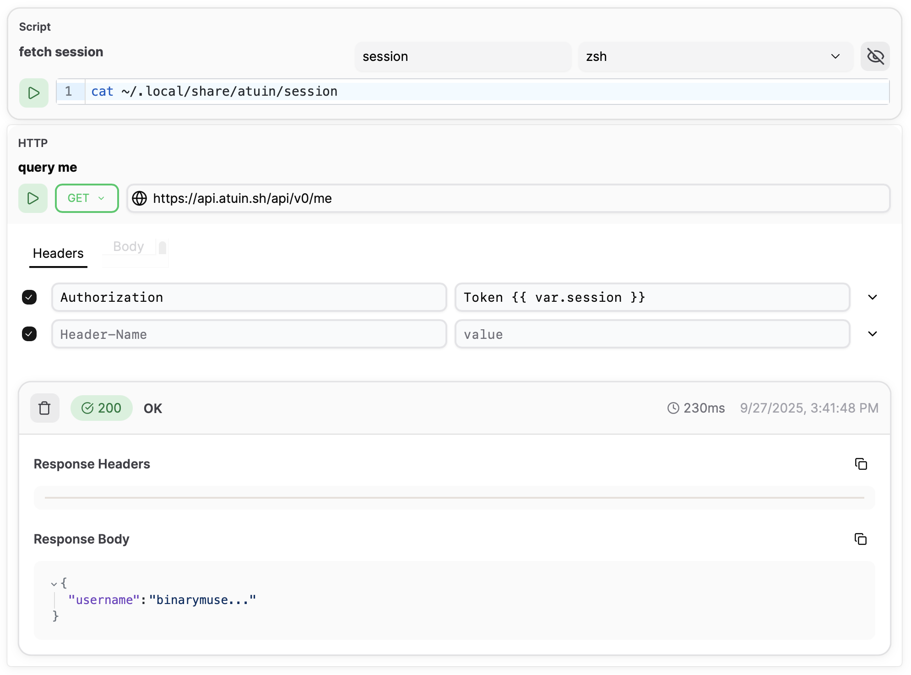
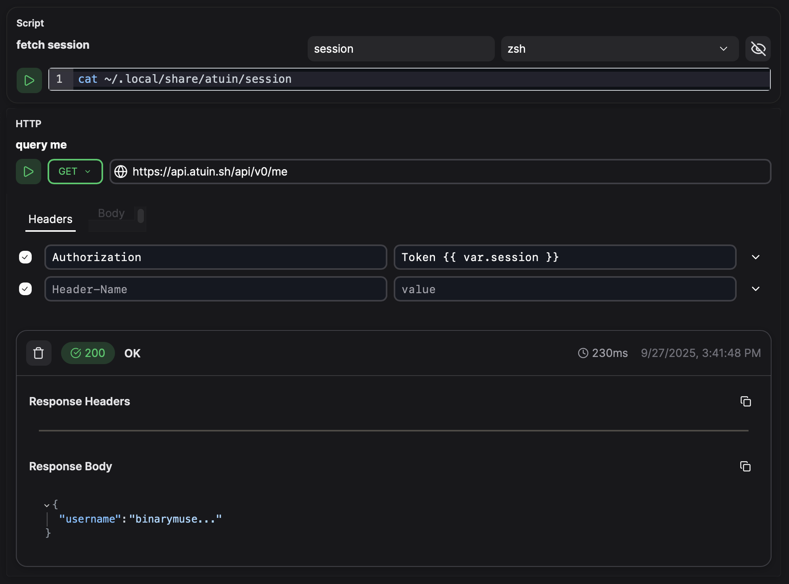

# シークレット

現在、シークレットの保存と管理のためのネイティブな統合機能はありません。

[実行可能](../blocks/executable/ "mention")ブロックを使用すると、サードパーティのシークレット管理ソリューションを統合したり、ローカルファイルシステムからシークレットを取得したりすることが簡単にできます。例：

<figure class="img-light">
  <picture>
    
  </picture>
  <figcaption></figcaption>
</figure>
<figure class="img-dark">
  <picture>
    
  </picture>
  <figcaption></figcaption>
</figure>
