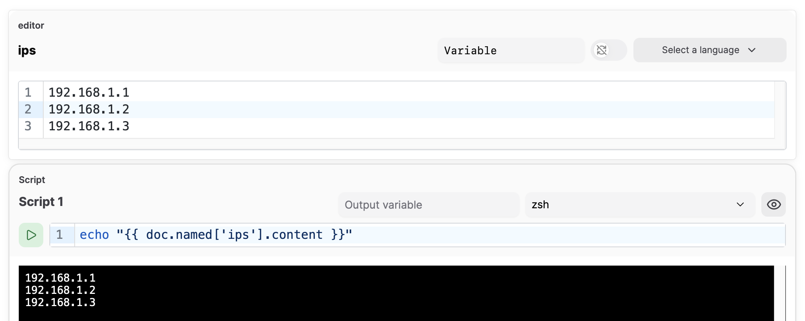
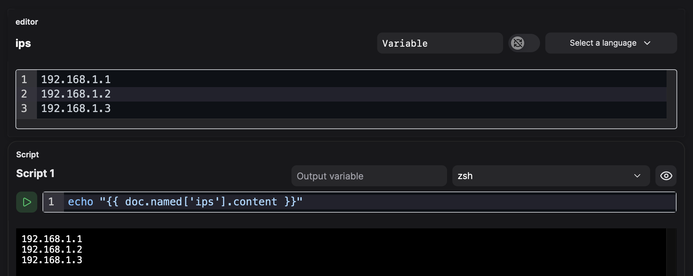

# テンプレート

#### **テンプレート**

Atuinはテンプレートのレンダリングに[MiniJinja](https://docs.rs/minijinja)を使用しており、柔軟な出力のカスタマイズが可能です。

**基本構文**

- **変数**: `{{ var.variable_name }}`
  - 変数は[script.md](blocks/executable/script.md "mention")ブロックで設定できます
- **フィルター**: `{{ text | upper }}`, `{{ list | join(", ") }}`
- **条件分岐**:

```django

echo "fooはtrueです"

echo "fooはfalseです"

```

- **ループ**:

```django

echo "{{ remote }}"

```

**組み込み関数**

- `range(n)`: シーケンスを生成 → `{{ i }}`
- `length(list)`: リストの長さを取得 → `{{ length(users) }}`
- `default(value, fallback)`: `None`の場合にフォールバックを使用 → `{{ user.name | default("Guest") }}`

### ドキュメントアクセス

テンプレートシステムは、ブロック、テキストなど、ドキュメント全体に完全にアクセスできます。

!!! warning
    このAPIはまだ反復中であり、将来のリリースで変更される可能性があります

まず、ブロックに名前を付けます。左上のデフォルト名の横にある鉛筆アイコンをクリックします。

その後、テンプレートシステム内で`{{ doc.named }}`マップを介して参照できます

<figure class="img-light">
  <picture>
    
  </picture>
  <figcaption>テンプレートシステムを介して、別のブロックからエディターブロックのコンテンツを使用する例</figcaption>
</figure>
<figure class="img-dark">
  <picture>
    
  </picture>
  <figcaption>テンプレートシステムを介して、別のブロックからエディターブロックのコンテンツを使用する例</figcaption>
</figure>
