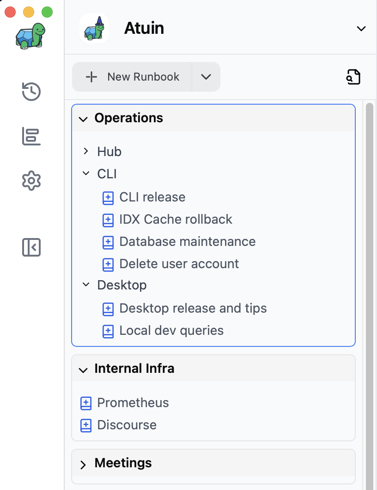
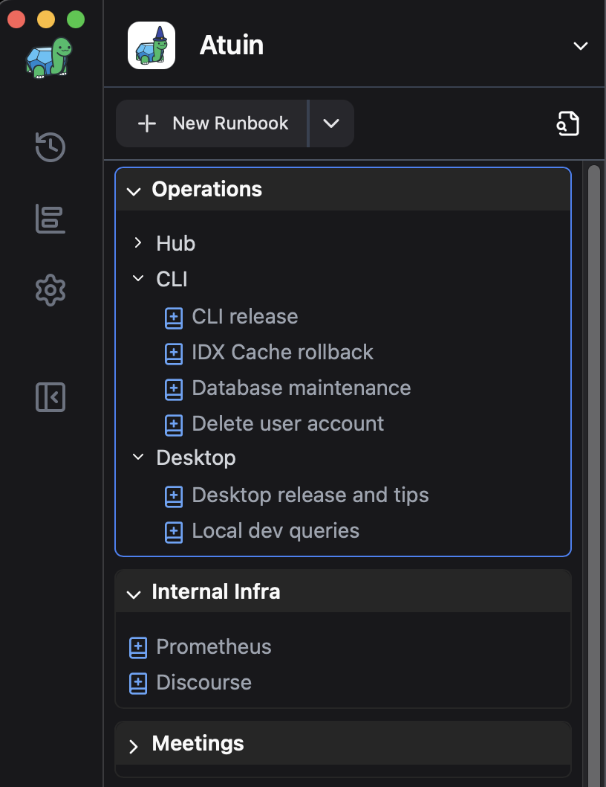

ワークスペースは、Runbookの最上位のコンテナです。デスクトップアプリの左側のサイドバーにあります。

<figure class="img-light">
  <picture>
    
  </picture>
  <figcaption>オペレーション、内部インフラ、会議はすべてワークスペースです</figcaption>
</figure>
<figure class="img-dark">
  <picture>
    
  </picture>
  <figcaption>オペレーション、内部インフラ、会議はすべてワークスペースです</figcaption>
</figure>

新しいワークスペースは、次の3つの方法のいずれかで作成できます。

1. アプリケーションメニューから`ファイル → ワークスペース → 新しいワークスペース`を選択します
2. 「新しいRunbook」ドロップダウン矢印から「新しいワークスペース」を選択します
3. サイドバーの空の領域を右クリックし、「新しいワークスペース」を選択します

各ワークスペースは、**オンライン**または**オフライン**のいずれかです。

## オンラインワークスペース

オンラインワークスペースは[Atuin Hub](../hub/getting-started)に同期され、追加されたすべてのRunbookは自動的にHubに保存されます。オンラインワークスペースを作成または編集するには、オンラインでHubにログインしている必要があります。詳細については、[はじめにガイド](../hub/getting-started)をご覧ください。

オンラインワークスペースのRunbookは、複数の共同編集者またはチームメンバーが同時に編集できます。詳細については、[共同編集ガイド](../hub/collaborative-editing)をご覧ください。

## オフラインワークスペース

オフラインワークスペースはHubに同期されず、追加されたすべてのRunbookはデバイスにローカルに保存されます。オフラインワークスペースを作成すると、Runbookを保存するデバイス上のフォルダーを選択するように求められます。

オフラインのRunbookは、オンラインのRunbookのようにエディター内で共同編集することはできませんが、ワークスペースフォルダーは、バージョン管理、VCSベースのコラボレーション、およびバックアップのためにGitまたは別のVCSで管理できます。
